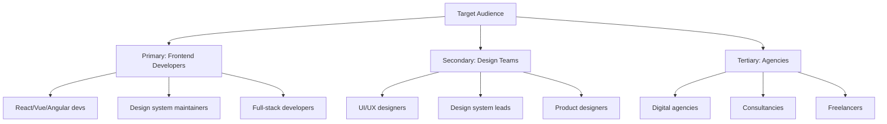

# 🚀 Estrategia de Marketing y Growth Hacking - Anclora Render

## 📋 Índice de Marketing

1. [**Market Research y Positioning**](#market-research-y-positioning)
2. [**Content Marketing Strategy**](#content-marketing-strategy)
3. [**SEO y SEM Strategy**](#seo-y-sem-strategy)
4. [**Social Media Strategy**](#social-media-strategy)
5. [**Influencer y Community Marketing**](#influencer-y-community-marketing)
6. [**Email Marketing Automation**](#email-marketing-automation)
7. [**Partnership Marketing**](#partnership-marketing)
8. [**Growth Hacking Tactics**](#growth-hacking-tactics)
9. [**Product Hunt Launch Strategy**](#product-hunt-launch-strategy)
10. [**Paid Advertising Strategy**](#paid-advertising-strategy)
11. [**Analytics y Attribution**](#analytics-y-attribution)
12. [**Budget y ROI Tracking**](#budget-y-roi-tracking)

---

## 🎯 Market Research y Positioning

### **Target Audience Analysis**



### **Detailed Persona Profiles**

#### **🎨 Primary Persona: "Alex the Frontend Developer"**
```yaml
demographics:
  age: 26-35
  location: US/EU tech hubs
  experience: 3-8 years
  salary: $70k-120k
  company_size: 50-500 employees

pain_points:
  - "Spending too much time on repetitive UI work"
  - "Design system inconsistencies across team"
  - "Storybook setup is too complex"
  - "Designer handoffs are unclear"
  - "Need to support multiple frameworks"

goals:
  - Ship features faster
  - Maintain consistent UI
  - Reduce technical debt
  - Focus on complex logic vs UI

behavior:
  - Active on Dev Twitter and Reddit
  - Reads CSS-Tricks, Smashing Magazine
  - Uses GitHub daily
  - Attends React/Vue conferences
  - Shares useful tools with team

preferred_content:
  - Technical tutorials
  - Tool comparisons
  - Best practices guides
  - Performance tips
  - Open source projects

messaging:
  primary: "Ship pixel-perfect components in seconds, not hours"
  secondary: "The AI-powered tool that actually understands your design system"
```

#### **🎨 Secondary Persona: "Sarah the Design Systems Lead"**
```yaml
demographics:
  age: 28-40
  location: US/EU/Canada
  experience: 5-12 years
  salary: $90k-150k
  company_size: 200+ employees

pain_points:
  - "Developers don't follow design system rules"
  - "Hard to scale design systems across teams"
  - "Inconsistent implementation across platforms"
  - "Manual design QA takes too much time"
  - "Figma to code gap is too wide"

goals:
  - Ensure design consistency
  - Scale design systems efficiently
  - Improve designer-developer collaboration
  - Reduce design system maintenance overhead

behavior:
  - Active on Design Twitter and Dribbble
  - Attends design conferences (Config, Design+Research)
  - Reads Design Systems publications
  - Manages design system documentation
  - Advocates for design tooling

preferred_content:
  - Design system case studies
  - Tool integrations
  - Team workflow optimization
  - Design-to-code best practices
  - ROI and business impact

messaging:
  primary: "Guarantee 100% design system compliance automatically"
  secondary: "Bridge the gap between design intent and code reality"
```

### **Competitive Positioning Map**

| **Tool** | **Setup Complexity** | **AI-Native** | **Multi-Framework** | **Price Point** |
|----------|---------------------|---------------|-------------------|----------------|
| **Anclora Render** | ⭐⭐⭐⭐⭐ Low | ⭐⭐⭐⭐⭐ Yes | ⭐⭐⭐⭐⭐ Yes | ⭐⭐⭐⭐ Affordable |
| Storybook | ⭐⭐ High | ❌ No | ⭐⭐⭐⭐ Yes | ⭐⭐⭐⭐⭐ Free |
| Chromatic | ⭐⭐ High | ❌ No | ⭐⭐⭐ Limited | ⭐⭐ Expensive |
| Figma Dev Mode | ⭐⭐⭐⭐ Low | ⭐⭐ Basic | ❌ No | ⭐⭐⭐ Moderate |

### **Unique Value Proposition**

> **"The only AI-powered component generator that guarantees 100% design system consistency across any framework - setup in 30 seconds, not 8 hours."**

**Supporting Pillars:**
1. **Time-to-Value**: 30 seconds vs 4-8 hours setup
2. **AI-Native**: Built for the AI era, not retrofitted
3. **Universal**: Works with any framework and design system
4. **Quality**: Pixel-perfect, accessible, performant code

---

## 📝 Content Marketing Strategy

### **Content Pillar Framework**

```yaml
content_pillars:
  educational: 40%  # How-to guides, tutorials, best practices
  inspirational: 25%  # Case studies, success stories, industry trends  
  promotional: 20%  # Product features, updates, comparisons
  community: 15%  # User-generated content, interviews, spotlights
```

### **Editorial Calendar Q1 2025**

| **Week** | **Blog Post** | **Tutorial** | **Social Content** | **Video** |
|----------|---------------|--------------|-------------------|-----------|
| Week 1 | "The State of Design Systems 2025" | "Building Your First AI Component" | 5 Twitter threads | Product Demo |
| Week 2 | "Why Storybook Setup Takes 8 Hours" | "Design System Tokens 101" | 3 LinkedIn articles | Feature Spotlight |
| Week 3 | "AI-Generated vs Hand-Coded Components" | "Multi-Framework Design Systems" | 7 Twitter tips | Tutorial Video |
| Week 4 | "Case Study: How Stripe Uses AI Components" | "Accessibility in AI-Generated Code" | 4 Instagram posts | Customer Story |

### **High-Impact Content Topics**

#### **🎯 SEO-Optimized Blog Posts**
```markdown
1. "Storybook vs Anclora Render: Complete Comparison Guide 2025"
   - Target: "storybook alternative" (2,900 searches/month)
   - Angle: Honest comparison highlighting our advantages
   - CTA: "Try Anclora Render free for 14 days"

2. "How to Build a Design System That Developers Actually Use"
   - Target: "design system implementation" (1,600 searches/month)
   - Angle: Practical guide with AI-powered solutions
   - CTA: "Generate your first component automatically"

3. "The Complete Guide to AI-Powered Frontend Development"
   - Target: "AI frontend development" (890 searches/month)
   - Angle: Thought leadership with practical examples
   - CTA: "Start building with AI today"

4. "React Component Generation: Manual vs AI Approach"
   - Target: "react component generator" (720 searches/month)
   - Angle: Time/quality comparison with real examples
   - CTA: "Generate React components instantly"

5. "Design System Consistency: Manual QA vs Automated Validation"
   - Target: "design system validation" (480 searches/month)
   - Angle: Show ROI of automated approach
   - CTA: "Validate your design system automatically"
```

#### **🎬 Video Content Strategy**

```yaml
youtube_channel: "Anclora Render"
upload_schedule: "2 videos/week"
target_length: "8-12 minutes"

video_series:
  - name: "AI Component Generation Masterclass"
    episodes: 8
    description: "Complete guide to AI-powered frontend development"
    
  - name: "Design System Deep Dives"
    episodes: 12
    description: "Breaking down successful design systems"
    
  - name: "Tool vs Tool"
    episodes: 6
    description: "Honest comparisons with competitors"
    
  - name: "Customer Spotlights"
    episodes: 10
    description: "Real teams sharing their success stories"

video_optimization:
  thumbnails: "High-contrast, faces, clear text"
  titles: "Include target keywords, emotional hooks"
  descriptions: "Detailed with timestamps, links, CTAs"
  tags: "Mix broad and specific, include competitor names"
```

### **Technical Content Distribution**

#### **📚 Developer Education Hub**
```markdown
documentation_site: "docs.anclora.com"
sections:
  - getting-started/
  - ai-prompting-guide/
  - design-system-integration/
  - framework-guides/
  - best-practices/
  - troubleshooting/
  - api-reference/

interactive_examples:
  - codepen_collection: "Anclora Generated Components"
  - github_examples: "anclora/examples"
  - storybook_showcase: "showcase.anclora.com"

guest_content:
  - dev_to_publications: "Frontend development communities"
  - medium_publications: "Better Programming, JavaScript in Plain English"
  - podcast_appearances: "Syntax.fm, React Podcast, Design Better"
```

---

## 🔍 SEO y SEM Strategy

### **Keyword Strategy & Targeting**

#### **🎯 Primary Keywords (High Volume, High Intent)**
```yaml
tier_1_keywords:
  - "storybook alternative": 2,900/month, Difficulty: 45
  - "component library tool": 1,800/month, Difficulty: 38
  - "design system tool": 1,600/month, Difficulty: 52
  - "ui component generator": 1,200/month, Difficulty: 41
  - "react component tool": 980/month, Difficulty: 44

tier_2_keywords:
  - "design system automation": 720/month, Difficulty: 35
  - "ai code generator": 890/month, Difficulty: 58
  - "frontend development tool": 1,100/month, Difficulty: 47
  - "component testing tool": 650/month, Difficulty: 42
  - "design to code": 540/month, Difficulty: 39

long_tail_keywords:
  - "how to build design system": 450/month, Difficulty: 28
  - "storybook setup time": 120/month, Difficulty: 15
  - "ai generated react components": 280/month, Difficulty: 32
  - "design system consistency": 180/month, Difficulty: 25
  - "component library best practices": 320/month, Difficulty: 30
```

#### **📊 Content-to-Keyword Mapping**
```markdown
Landing Pages:
- "/" → "ai component generator", "design system tool"
- "/storybook-alternative" → "storybook alternative", "storybook vs"
- "/pricing" → "component tool pricing", "design system cost"
- "/features" → "ai code generation", "design system automation"

Blog Content:
- "Complete Guide to Design Systems" → "design system guide"
- "Storybook Alternative Comparison" → "storybook alternative"
- "AI Frontend Development" → "ai frontend development"
- "Component Testing Best Practices" → "component testing"

Tool Pages:
- "/react" → "react component generator", "react ui library"
- "/vue" → "vue component generator", "vue design system"
- "/angular" → "angular component generator", "angular ui toolkit"
```

### **Technical SEO Implementation**

```javascript
// SEO Configuration
const seoConfig = {
  sitemap: {
    baseUrl: 'https://render.anclora.com',
    generateRobotsTxt: true,
    generateIndexSitemap: false,
    exclude: ['/admin/*', '/api/*', '/dashboard/*'],
    changefreq: 'daily',
    priority: {
      '/': 1.0,
      '/features': 0.9,
      '/pricing': 0.9,
      '/blog/*': 0.8,
      '/docs/*': 0.7
    }
  },
  
  metadata: {
    titleTemplate: '%s | Anclora Render - AI Component Generator',
    defaultTitle: 'Anclora Render - AI-Powered Component Generator',
    description: 'Generate pixel-perfect UI components with AI. Support for React, Vue, Angular. Setup in 30 seconds, not hours.',
    keywords: 'ai component generator, design system, storybook alternative, react components, vue components',
    authors: [{ name: 'Anclora Team' }],
    creator: 'Anclora',
    publisher: 'Anclora',
    robots: 'index, follow',
    
    openGraph: {
      type: 'website',
      locale: 'en_US',
      siteName: 'Anclora Render',
      images: [
        {
          url: '/og-image.jpg',
          width: 1200,
          height: 630,
          alt: 'Anclora Render - AI Component Generator'
        }
      ]
    },
    
    twitter: {
      card: 'summary_large_image',
      site: '@anclorarender',
      creator: '@anclorarender'
    }
  },
  
  structuredData: {
    organization: {
      '@context': 'https://schema.org',
      '@type': 'Organization',
      name: 'Anclora',
      url: 'https://render.anclora.com',
      logo: 'https://render.anclora.com/logo.png',
      sameAs: [
        'https://twitter.com/anclorarender',
        'https://github.com/anclora',
        'https://linkedin.com/company/anclora'
      ]
    },
    
    product: {
      '@context': 'https://schema.org',
      '@type': 'SoftwareApplication',
      name: 'Anclora Render',
      applicationCategory: 'DeveloperApplication',
      operatingSystem: 'Web',
      offers: {
        '@type': 'Offer',
        price: '0',
        priceCurrency: 'USD'
      },
      aggregateRating: {
        '@type': 'AggregateRating',
        ratingValue: '4.9',
        reviewCount: '127'
      }
    }
  }
};
```

### **Google Ads Campaign Structure**

#### **🎯 Campaign 1: Competitor Campaigns**
```yaml
campaign_name: "Anclora vs Competitors"
budget: $2,000/month
target_cpa: $25

ad_groups:
  storybook_alternative:
    keywords:
      - "storybook alternative"
      - "storybook competitor" 
      - "better than storybook"
    ads:
      headline_1: "Storybook Alternative"
      headline_2: "Setup in 30 Seconds"
      headline_3: "AI-Powered Components"
      description: "Skip the 8-hour Storybook setup. Generate components with AI instantly. Free trial, no credit card required."
      
  figma_dev_mode:
    keywords:
      - "figma dev mode alternative"
      - "figma to code"
      - "design to code tool"
    ads:
      headline_1: "Beyond Figma Dev Mode"
      headline_2: "AI Generates Real Code"
      headline_3: "Any Framework Support"
```

#### **🎯 Campaign 2: High-Intent Keywords**
```yaml
campaign_name: "Component Generation Intent"
budget: $3,000/month
target_cpa: $30

ad_groups:
  component_generator:
    keywords:
      - "component generator"
      - "ui component generator"
      - "react component generator"
    ads:
      headline_1: "AI Component Generator"
      headline_2: "Pixel-Perfect Code"
      headline_3: "React, Vue, Angular"
      
  design_system_tools:
    keywords:
      - "design system tool"
      - "design system automation"
      - "design system consistency"
    ads:
      headline_1: "Design System Automation"
      headline_2: "100% Consistency Guaranteed"
      headline_3: "Setup in 30 Seconds"
```

---

## 📱 Social Media Strategy

### **Platform-Specific Strategy**

#### **🐦 Twitter/X Strategy**
```yaml
handle: "@anclorarender"
posting_frequency: "3-5 tweets/day"
engagement_goal: "Build developer community"

content_mix:
  tips_and_tricks: 35%  # Quick development tips
  product_updates: 20%  # New features, improvements
  community_content: 25%  # Retweets, replies, discussions  
  behind_the_scenes: 10%  # Team, process insights
  industry_commentary: 10%  # Hot takes, trend analysis

thread_topics:
  - "10 ways AI will change frontend development"
  - "Design system mistakes I see everywhere"
  - "Why most component libraries fail"
  - "The future of design-to-code tools"
  - "Building a design system that scales"

engagement_tactics:
  - Reply to popular dev tweets with value
  - Quote tweet with additional insights
  - Start polls about tool preferences
  - Share quick video demos
  - Host Twitter Spaces monthly
```

#### **💼 LinkedIn Strategy**
```yaml
company_page: "Anclora"
employee_advocacy: "Entire team posts"
posting_frequency: "1 post/day"

content_themes:
  thought_leadership: 40%  # Industry insights, predictions
  company_updates: 25%    # Milestones, hiring, culture
  educational_content: 20%  # How-tos, best practices
  customer_success: 15%    # Case studies, testimonials

article_topics:
  - "The ROI of Design System Automation"
  - "Why AI-Generated Code is Production-Ready"
  - "Building Design Systems That Developers Love"
  - "The Hidden Costs of Manual Component Development"
  - "How We Built an AI That Understands Design"

networking_strategy:
  - Connect with design system leads
  - Engage with frontend development content
  - Comment thoughtfully on competitor posts
  - Share team members' expertise
  - Participate in design/dev groups
```

#### **📺 YouTube Strategy**
```yaml
channel_name: "Anclora Render"
upload_schedule: "2 videos/week"
subscriber_goal: "10k in Q1 2025"

content_categories:
  tutorials: 45%      # How-to guides, walkthroughs
  comparisons: 25%    # Tool vs tool, before/after
  case_studies: 15%   # Customer stories, results
  behind_scenes: 10%  # Development process, team
  live_streams: 5%    # Q&A, product demos

optimization_strategy:
  - Custom thumbnails with faces and contrasting colors
  - Keyword-optimized titles and descriptions
  - Detailed timestamps and chapter markers
  - End screens promoting related videos
  - Community tab for polls and updates
  - Playlists for different user journeys
```

### **Social Media Calendar Template**

| **Day** | **Twitter** | **LinkedIn** | **YouTube** | **Instagram** |
|---------|-------------|--------------|-------------|---------------|
| Monday | Industry tip thread | Thought leadership article | Tutorial video | Behind-the-scenes story |
| Tuesday | Product demo video | Company update | - | Design inspiration |
| Wednesday | Quick tip + engagement | Educational post | - | Team spotlight |
| Thursday | Community highlight | Customer success story | Product comparison | Quick tip graphic |
| Friday | Week wrap-up thread | Industry trend analysis | - | Friday feature highlight |
| Saturday | Casual development tip | - | - | Weekend project |
| Sunday | Sunday reflection | - | Weekly livestream | Sunday inspiration |

---

## 🤝 Influencer y Community Marketing

### **Influencer Tier Strategy**

#### **🌟 Tier 1: Mega-Influencers (500k+ followers)**
```yaml
target_profiles:
  - Kent C. Dodds (@kentcdodds) - React educator
  - Wes Bos (@wesbos) - Full-stack developer
  - Brad Traversy (@traversymedia) - Developer educator
  - Fireship (@fireship_dev) - Developer content

partnership_approach:
  - Sponsored content integration
  - Product review videos  
  - Conference speaking opportunities
  - Long-term brand ambassadorship

budget_allocation: "$15,000/month"
expected_reach: "2M+ developers"
```

#### **🎯 Tier 2: Macro-Influencers (50k-500k followers)**
```yaml
target_profiles:
  - Josh W. Comeau (@joshwcomeau) - Frontend specialist
  - Emma Bostian (@emmabostian) - Frontend developer
  - Cassidy Williams (@cassidoo) - Developer advocate
  - Jason Lengstorf (@jlengstorf) - Developer experience
  - Ankita Kulkarni (@ankitakulkarni) - Design systems

collaboration_types:
  - Sponsored posts and threads
  - Product demos and tutorials
  - Podcast appearances
  - Conference workshop mentions
  - Newsletter sponsorships

budget_allocation: "$8,000/month"
expected_reach: "500k developers"
```

#### **💎 Tier 3: Micro-Influencers (10k-50k followers)**
```yaml
target_count: "25 active partnerships"
focus_areas:
  - React/Vue/Angular specialists
  - Design system advocates  
  - Developer tool reviewers
  - Frontend newsletter writers
  - YouTube tutorial creators

collaboration_approach:
  - Free Pro accounts
  - Early access to features
  - Co-created content
  - Affiliate partnerships
  - Community moderator roles

budget_allocation: "$3,000/month"
expected_reach: "250k engaged developers"
```

### **Community Building Strategy**

#### **🏠 Own Community Platforms**

```yaml
discord_server: "Anclora Developers"
target_members: "5,000 by Q2 2025"
channels:
  - general-chat
  - showcase-your-work
  - ai-generated-components
  - design-systems
  - framework-specific (react, vue, angular)
  - feedback-and-suggestions
  - jobs-and-opportunities

engagement_activities:
  - Weekly design challenges
  - Monthly component competitions
  - Live coding sessions with team
  - Expert AMAs (Ask Me Anything)
  - Beta feature previews
  - Community spotlight features

moderation_team: "5 volunteer moderators"
community_manager: "Full-time role"
```

#### **📚 External Community Presence**

```yaml
reddit_communities:
  - r/webdev (2.8M members)
  - r/reactjs (500k members)
  - r/frontend (180k members)
  - r/webdesign (850k members)
  - r/javascript (2.1M members)

engagement_strategy:
  - Share valuable content 80% / promote 20%
  - Answer questions thoroughly
  - Participate in weekly threads
  - Host AMAs quarterly
  - Sponsor community events

slack_communities:
  - Designer Hangout (60k members)
  - Mixed Methods (25k members)
  - Design System Coalition (15k members)
  - Frontend Developers (40k members)

facebook_groups:
  - Frontend Developer Community (180k members)
  - React Developers (95k members)
  - UI/UX Designers Community (220k members)
```

---

## 📧 Email Marketing Automation

### **Email Funnel Architecture**

#### **🎯 Lead Magnet Sequence**
```yaml
trigger: "Download free design system checklist"
sequence_length: "7 emails over 14 days"

email_1: "Welcome + Checklist Delivery" (immediate)
  subject: "Your Design System Checklist + Quick Start Guide"
  content: "Deliver checklist, introduce Anclora briefly"
  cta: "Try Anclora Render Free"

email_2: "Design System Problems" (day 2)  
  subject: "The #1 reason design systems fail (and how to avoid it)"
  content: "Common pitfalls, position Anclora as solution"
  cta: "See How Anclora Solves This"

email_3: "Social Proof" (day 4)
  subject: "How [Customer] reduced component dev time by 70%"
  content: "Customer case study with specific metrics"
  cta: "Start Your Free Trial"

email_4: "Comparison Content" (day 7)
  subject: "Storybook vs Anclora: The honest comparison"
  content: "Fair comparison highlighting advantages"
  cta: "Try Anclora Risk-Free"

email_5: "Tutorial Content" (day 10)
  subject: "Generate your first AI component in 60 seconds"
  content: "Step-by-step tutorial with GIFs/video"
  cta: "Generate Your Component Now"

email_6: "Urgency + Incentive" (day 12)
  subject: "Last chance: Extended trial for checklist subscribers"
  content: "Limited-time offer for extended trial"
  cta: "Claim Extended Trial"

email_7: "Final Value + Soft Sell" (day 14)
  subject: "The future of component development is here"
  content: "Vision for AI in development, soft product mention"
  cta: "Join the AI Revolution"
```

#### **🚀 Trial User Onboarding**
```yaml
trigger: "User signs up for free trial"
sequence_length: "5 emails over trial period"

email_1: "Welcome + Quick Start" (immediate)
  subject: "Welcome to Anclora! Your first component in 2 minutes"
  content: "Welcome, quick tutorial, first success"
  cta: "Generate Your First Component"

email_2: "Feature Deep Dive" (day 2)
  subject: "Design systems made simple (see how inside)"
  content: "Explain design system integration"
  cta: "Connect Your Design System"

email_3: "Use Case Examples" (day 4)  
  subject: "5 components you can build right now"
  content: "Specific examples with prompts"
  cta: "Try These Examples"

email_4: "Social Proof + Advanced Features" (day 7)
  subject: "What developers are saying about Anclora"
  content: "Testimonials + advanced feature showcase"
  cta: "Explore Advanced Features"

email_5: "Trial Ending Soon" (day 12)
  subject: "Your trial ends in 2 days - here's what you've accomplished"
  content: "Trial summary, upgrade incentive"
  cta: "Upgrade to Keep Building"
```

### **Segmentation Strategy**

```yaml
segments:
  by_role:
    - frontend_developers
    - designers
    - design_system_leads
    - engineering_managers
    - freelancers
  
  by_framework:
    - react_users
    - vue_users
    - angular_users
    - multi_framework_users
  
  by_company_size:
    - startup (1-50 employees)
    - scaleup (51-200 employees)
    - enterprise (200+ employees)
  
  by_engagement:
    - highly_engaged (opens + clicks regularly)
    - moderately_engaged (opens occasionally)
    - low_engagement (rarely opens)
    - inactive (no engagement 30+ days)
  
  by_trial_status:
    - active_trial
    - expired_trial_no_conversion
    - converted_to_paid
    - cancelled_subscription

messaging_customization:
  frontend_developers:
    - Focus on time savings and code quality
    - Technical deep dives
    - Framework-specific examples
    
  designers:
    - Emphasize design consistency
    - Designer-developer collaboration
    - Visual examples and case studies
    
  engineering_managers:
    - ROI and productivity metrics
    - Team efficiency improvements
    - Scaling challenges solutions
```

---

## 🤝 Partnership Marketing

### **Strategic Partnership Categories**

#### **🔧 Tool Integrations**
```yaml
figma_partnership:
  type: "Official Plugin"
  value_proposition: "Import Figma designs directly to Anclora"
  mutual_benefits:
    - Figma: Extend platform capabilities
    - Anclora: Access to 4M+ designers
  launch_plan:
    - Joint announcement
    - Co-hosted webinar
    - Cross-promotion in apps
    - Conference demo together

github_partnership:
  type: "GitHub Actions Integration"
  value_proposition: "Generate components in CI/CD pipeline"
  mutual_benefits:
    - GitHub: Showcase AI developer tools
    - Anclora: Access to 100M+ developers
  launch_plan:
    - GitHub Universe keynote mention
    - Developer documentation co-creation
    - GitHub Stars program inclusion

vscode_extension:
  type: "Official VS Code Extension"
  value_proposition: "Generate components without leaving editor"
  benefits:
    - Seamless developer workflow
    - Increased daily usage
    - Higher user retention
  metrics_target:
    - 50k+ installs in Q1
    - 4.5+ star rating
    - Featured in VS Code marketplace
```

#### **🎓 Educational Partnerships**
```yaml
bootcamp_partnerships:
  targets:
    - Lambda School / Bloom Institute of Technology
    - General Assembly
    - Flatiron School
    - App Academy
    - Thinkful
  
  partnership_model:
    - Free Pro accounts for students
    - Curriculum integration
    - Guest lectures from team
    - Job placement program for graduates
    - Co-branded certification

university_programs:
  targets:
    - Stanford CS Department
    - MIT Computer Science
    - Carnegie Mellon HCII
    - UC Berkeley EECS
    - University of Washington
  
  collaboration_types:
    - Research partnerships on AI+Design
    - Student competition sponsorships
    - Guest lecture series
    - Internship programs
    - Open source contributions
```

#### **🏢 B2B Partnerships**
```yaml
design_agencies:
  tier_1_targets:
    - IDEO
    - Frog Design
    - Pentagram
    - Huge
    - R/GA
  
  partnership_benefits:
    - White-label deployment options
    - Custom design system integrations
    - Dedicated account management
    - Co-marketing opportunities
    - Revenue sharing on client projects

consulting_firms:
  targets:
    - Accenture Interactive
    - IBM iX
    - Deloitte Digital
    - PwC Experience Consulting
    - EY Doberman
  
  value_proposition:
    - Accelerate client project delivery
    - Demonstrate AI transformation
    - Reduce project risk
    - Standardize component development
    - Improve client satisfaction scores
```

### **Partnership ROI Tracking**

```yaml
metrics_framework:
  lead_generation:
    - Partner-referred signups
    - Conversion rate by partner
    - Customer lifetime value (CLV)
    - Cost per acquisition (CPA)
  
  brand_awareness:
    - Co-branded content reach
    - Mention share in partner content
    - Search volume for branded terms
    - Social media brand mentions
  
  product_adoption:
    - Feature usage from partnerships
    - Integration adoption rates
    - User engagement improvements
    - Retention rate improvements
  
  revenue_attribution:
    - Direct revenue from partner channel
    - Influenced revenue (multi-touch)
    - Partner-driven upsells
    - Contract expansions via partnerships
```

---

## 🚀 Growth Hacking Tactics

### **Viral Growth Mechanisms**

#### **🎯 Product-Led Growth Features**
```yaml
referral_program:
  mechanics:
    - Give: 1 month Pro free for each successful referral
    - Get: Referred user gets 2 weeks extra trial
    - Limit: No limit on referrals
  
  implementation:
    - Unique referral links for each user
    - In-app sharing widgets
    - Email signature integration
    - Social sharing automation
  
  tracking:
    - Referral conversion funnel
    - Viral coefficient calculation
    - Time to referral (T2R)
    - Referral source attribution

component_sharing:
  mechanics:
    - Public gallery of user-generated components
    - "Made with Anclora" attribution
    - One-click import to own account
    - Social sharing for impressive components
  
  growth_impact:
    - Showcase product capabilities
    - Attract new users through SEO
    - Encourage more usage to create shareable components
    - Build developer community around tool
```

#### **🎪 Viral Marketing Campaigns**

```yaml
ai_component_challenge:
  concept: "Generate the most creative component with AI"
  mechanics:
    - Monthly theme (e.g., "Retro Components", "Accessibility Heroes")
    - Voting by community
    - Winners featured on social media
    - Prize: 1 year Pro subscription
  
  amplification:
    - Influencer judges
    - Twitter hashtag campaigns
    - Community voting
    - Winner showcase videos

design_system_audit:
  concept: "Free AI-powered design system analysis"
  mechanics:
    - Upload existing components
    - AI analyzes consistency issues
    - Detailed report with improvement suggestions
    - Report shareable on social media
  
  lead_generation:
    - Email required for detailed report
    - Follow-up sequence with solutions
    - Demonstrate product value upfront
    - Generate PR through interesting findings
```

### **Growth Experiments Framework**

#### **🧪 A/B Testing Pipeline**
```yaml
experiment_categories:
  onboarding_optimization:
    - Landing page variations
    - Signup flow simplification
    - First-user experience paths
    - Activation event optimization
  
  retention_improvement:
    - Email cadence testing
    - Feature discovery flows
    - Engagement notification timing
    - Churn prevention interventions
  
  monetization_optimization:
    - Pricing page layouts
    - Trial length variations
    - Upgrade prompt positioning
    - Payment flow optimization

current_experiments:
  experiment_1:
    name: "Landing Page Hero Section"
    hypothesis: "Video demo vs static image increases trial signups"
    traffic_split: "50/50"
    success_metric: "Trial signup rate"
    duration: "2 weeks"
    significance_level: "95%"
  
  experiment_2:
    name: "Onboarding Tutorial Length"
    hypothesis: "Shorter tutorial increases activation"
    variants:
      - "3-step tutorial"
      - "5-step tutorial (current)"
      - "7-step comprehensive"
    success_metric: "First component generated"
```

### **Content Virality Strategies**

#### **📊 Data-Driven Content**
```yaml
industry_reports:
  - "State of Design Systems 2025"
  - "AI in Frontend Development Survey"
  - "Component Development Time Study"
  - "Design-to-Code Gap Analysis"

research_methodology:
  - Survey 1000+ developers
  - Analyze popular design systems
  - Time tracking studies
  - Interview industry leaders

distribution_strategy:
  - Press release to tech media
  - Exclusive early access for influencers
  - Social media campaign with key insights
  - Presentation at industry conferences
  - Podcast tour discussing findings
```

#### **🎬 Viral Video Concepts**
```yaml
video_experiments:
  - "Developer Reacts to AI-Generated Components"
  - "Design System Fails That Could Have Been Avoided"
  - "Building a Startup's Design System in 10 Minutes"
  - "Storybook Setup: 8 Hours vs 30 Seconds"
  - "Designer vs Developer: Component Generation Battle"

optimization_tactics:
  - Hook viewers in first 3 seconds
  - Include surprising statistics
  - Use trending audio/music
  - Add captions for accessibility
  - Create cliffhangers for series content
  - End with strong call-to-action
```

---

## 🏆 Product Hunt Launch Strategy

### **Pre-Launch Phase (4 weeks before)**

#### **Week 1: Foundation Building**
```yaml
preparation_tasks:
  - Finalize Product Hunt profile
  - Create high-quality screenshots and GIFs
  - Write compelling product description
  - Prepare maker comment strategy
  - Set up analytics tracking

asset_creation:
  - Logo variations for different backgrounds
  - Product demo video (60-90 seconds)
  - Feature highlight screenshots
  - Mobile mockups for responsive design
  - Team photos for maker profiles

hunter_outreach:
  - Identify top hunters in developer tools category
  - Reach out with personalized pitches
  - Offer exclusive early access
  - Build relationships 2-3 weeks ahead
  - Confirm hunter availability for launch day
```

#### **Week 2-3: Community Building**
```yaml
follower_acquisition:
  - Add "Coming Soon" badge to website
  - Email existing users about upcoming launch
  - Share sneak peeks on social media
  - Guest on relevant podcasts mentioning launch
  - Engage with Product Hunt community

influencer_preparation:
  - Send early access to key influencers
  - Request support on launch day
  - Prepare quotable testimonials
  - Create co-promotion opportunities
  - Schedule coordinated social media posts
```

#### **Week 4: Final Preparations**
```yaml
launch_day_logistics:
  - Confirm hunter for 12:01 AM PST launch
  - Prepare maker comments and replies
  - Schedule social media posts
  - Brief team on response strategy
  - Set up war room with monitoring tools

backup_plans:
  - Secondary hunter contact
  - Alternative launch date
  - Crisis communication plan
  - Technical issue contingencies
  - Competitive response strategies
```

### **Launch Day Execution**

#### **🕐 Timeline (PST)**
```yaml
12:01_AM: "Product goes live"
  - Hunter submits product
  - Team validates submission
  - First maker comment posted
  - Monitoring begins

6:00_AM: "Early momentum push"
  - Email blast to user base
  - Social media campaign starts
  - Team personal network activation
  - Influencer outreach activation

9:00_AM: "Business hours amplification"
  - Press release distribution
  - Slack community notifications
  - LinkedIn company update
  - Podcast mention activations

12:00_PM: "Midday assessment"
  - Ranking evaluation
  - Strategy adjustment if needed
  - Additional outreach if necessary
  - Community engagement boost

3:00_PM: "Afternoon push"
  - West Coast audience targeting
  - Final influencer activations
  - User-generated content encouragement
  - Last-mile voter mobilization

6:00_PM: "International audience"
  - European audience targeting
  - Different timezone social posts
  - Community platform shares
  - International PR distribution

9:00_PM: "Final sprint"
  - All-hands community activation
  - Emergency network mobilization
  - Last voter push
  - Competition analysis and response
```

### **Post-Launch Strategy**

#### **🎯 Week 1 After Launch**
```yaml
momentum_maintenance:
  - Thank you campaign to supporters
  - Press follow-up on ranking results
  - User acquisition campaign based on badge
  - Content creation around success metrics
  - Community celebration and engagement

analytics_deep_dive:
  - Traffic source analysis
  - Conversion rate assessment  
  - User behavior pattern analysis
  - Social media reach evaluation
  - ROI calculation on effort invested

relationship_building:
  - Follow up with new connections
  - Maintain hunter relationships
  - Engage with Product Hunt community
  - Connect with other makers
  - Build ongoing partnership opportunities
```

---

## 💰 Paid Advertising Strategy

### **Google Ads Campaign Structure**

#### **🎯 Campaign 1: High-Intent Search**
```yaml
campaign_name: "Anclora - High Intent Keywords"
budget: "$3,000/month"
target_cpa: "$25"
geographic_targeting: "US, CA, UK, AU, DE, NL"

ad_groups:
  component_generator:
    keywords:
      - "component generator"
      - "ui component generator" 
      - "react component generator"
      - "ai component generator"
    ad_copy:
      headline_1: "AI Component Generator"
      headline_2: "Generate in 30 Seconds"
      headline_3: "React, Vue, Angular"
      description_1: "Skip manual coding. Generate pixel-perfect components with AI."
      description_2: "Free trial. No credit card required. Start building today."
    
  design_system_tools:
    keywords:
      - "design system tool"
      - "design system automation"
      - "design system generator"
    ad_copy:
      headline_1: "Design System Automation"
      headline_2: "100% Consistency Guaranteed"  
      headline_3: "Setup in 30 Seconds"
      description_1: "Automate your design system. Ensure pixel-perfect consistency."
      description_2: "Try free for 14 days. No setup required."
```

#### **🎯 Campaign 2: Competitor Targeting**
```yaml
campaign_name: "Anclora - Competitor Keywords"
budget: "$2,500/month"
target_cpa: "$30"

ad_groups:
  storybook_alternative:
    keywords:
      - "storybook alternative"
      - "better than storybook"
      - "storybook competitor"
    ad_copy:
      headline_1: "Storybook Alternative"
      headline_2: "30 Second Setup"
      headline_3: "AI-Powered Components"
      description_1: "Skip the 8-hour Storybook setup. AI generates components instantly."
      description_2: "Free trial, no configuration required."
  
  figma_dev_mode:
    keywords:
      - "figma dev mode alternative"
      - "figma to code"
      - "design to code tool"
    ad_copy:
      headline_1: "Beyond Figma Dev Mode"
      headline_2: "Generate Real Code"
      headline_3: "Any Framework"
      description_1: "AI generates production-ready components, not just specs."
      description_2: "Support for React, Vue, Angular. Start free."
```

### **Social Media Advertising**

#### **🎯 LinkedIn Ads Strategy**
```yaml
campaign_objective: "Lead Generation"
budget: "$2,000/month"
targeting:
  job_titles:
    - "Frontend Developer"
    - "Full Stack Developer" 
    - "Design System Lead"
    - "Engineering Manager"
    - "UI/UX Designer"
  
  company_size: "51-10,000 employees"
  seniority: "Mid-Senior level"
  skills: ["React", "Vue.js", "Angular", "Design Systems"]

ad_formats:
  sponsored_content:
    - Carousel showcasing different components
    - Single image with strong CTA
    - Video demo of component generation
  
  message_ads:
    - Personalized outreach to design system leads
    - Custom landing page for each industry
    - Free consultation offer

lead_magnets:
  - "Design System Audit Checklist"
  - "Component Library Best Practices Guide"
  - "ROI Calculator for Design System Automation"
```

#### **🎯 YouTube Ads Strategy**
```yaml
campaign_type: "Video campaigns"
budget: "$1,500/month"
targeting:
  demographics: "25-45 years old"
  interests: 
    - "Web Development"
    - "Software Development"
    - "User Interface Design"
    - "React.js"
  
  custom_audiences:
    - Visitors to competitor websites
    - Engaged with similar YouTube channels
    - Downloaded design/development tools

video_ad_formats:
  skippable_in_stream:
    - 30-second product demos
    - Customer success stories
    - Before/after comparisons
  
  discovery_ads:
    - "How to Build Components 10x Faster"
    - "Storybook vs AI: Which is Better?"
    - "The Future of Frontend Development"
```

### **Retargeting Campaigns**

#### **🔄 Website Visitors Retargeting**
```yaml
audiences:
  landing_page_visitors:
    - Visited homepage but didn't sign up
    - Time on site > 30 seconds
    - Viewed pricing page
  
  trial_abandoners:
    - Started signup but didn't complete
    - Completed signup but didn't activate
    - Used trial but didn't convert

ad_messaging:
  landing_visitors: "See what you're missing. Start your free trial."
  trial_abandoners: "Come back and build something amazing."
  expired_trials: "Ready to upgrade? Special offer for returning users."

budget_allocation:
  - Google Display Network: $800/month
  - Facebook/Instagram: $600/month  
  - LinkedIn: $400/month
  - YouTube: $300/month
```

---

## 📊 Analytics y Attribution

### **Marketing Analytics Stack**

```javascript
// Analytics Configuration
const analyticsConfig = {
  // Core Analytics
  googleAnalytics: {
    trackingId: 'GA4-XXXXXXXX',
    events: [
      'page_view',
      'sign_up',
      'trial_start',
      'first_component_generated',
      'subscription_created',
      'component_shared'
    ],
    customDimensions: {
      userType: 'developer|designer|manager',
      companySize: 'startup|scaleup|enterprise',
      trafficSource: 'organic|paid|referral|direct',
      framework: 'react|vue|angular|vanilla'
    }
  },
  
  // Attribution Tracking
  attribution: {
    model: 'data_driven', // vs first_click, last_click, linear
    lookbackWindow: '90_days',
    channels: [
      'organic_search',
      'paid_search', 
      'social_organic',
      'social_paid',
      'email',
      'referral',
      'direct',
      'display'
    ]
  },
  
  // Customer Journey Tracking
  journeyTracking: {
    touchpoints: [
      'first_visit',
      'content_engagement',
      'trial_signup',
      'first_activation',
      'feature_adoption',
      'upgrade_consideration',
      'subscription_purchase'
    ],
    cohortAnalysis: {
      dimensions: ['acquisition_month', 'traffic_source', 'user_type'],
      metrics: ['retention', 'ltv', 'feature_adoption']
    }
  }
};
```

### **Key Performance Indicators (KPIs)**

#### **📈 Acquisition Metrics**
```yaml
traffic_metrics:
  organic_traffic_growth: "25% MoM"
  paid_traffic_roi: "3:1 minimum"
  referral_traffic_percentage: "> 15%"
  direct_traffic_growth: "15% MoM"

conversion_metrics:
  trial_signup_rate: "> 8%"
  landing_page_conversion: "> 4%"
  organic_search_conversion: "> 6%"
  paid_search_conversion: "> 12%"

channel_performance:
  cost_per_acquisition:
    - organic_search: "$15"
    - paid_search: "$25" 
    - social_media: "$35"
    - content_marketing: "$20"
  
  customer_lifetime_value:
    - free_trial_users: "$45"
    - pro_subscribers: "$380"
    - enterprise_clients: "$2,400"
```

#### **🎯 Engagement Metrics**
```yaml
content_performance:
  blog_post_metrics:
    - avg_time_on_page: "> 3 minutes"
    - bounce_rate: "< 60%"
    - social_shares: "> 50 per post"
    - email_subscribers: "> 5% conversion"
  
  video_metrics:
    - watch_time_percentage: "> 45%"
    - subscriber_conversion: "> 8%"
    - click_through_rate: "> 4%"

social_media_engagement:
  twitter:
    - followers_growth: "500/month"
    - engagement_rate: "> 3.5%"
    - click_through_rate: "> 2%"
  
  linkedin:
    - company_followers: "300/month"
    - post_engagement: "> 5%"
    - lead_generation: "20/month"
```

### **Attribution Modeling**

#### **🔍 Multi-Touch Attribution**
```yaml
attribution_model: "Data-Driven Attribution"
touchpoint_weights:
  first_touch: "20%"
  middle_touches: "40%"  
  last_touch: "40%"

channel_attribution:
  organic_search:
    - first_touch: "35%"
    - assist: "25%"
    - last_touch: "40%"
  
  content_marketing:
    - first_touch: "45%"
    - assist: "40%"
    - last_touch: "15%"
  
  paid_search:
    - first_touch: "20%"
    - assist: "20%"
    - last_touch: "60%"

cross_device_tracking:
  - Google Analytics 4 User ID
  - Customer Data Platform integration
  - Email-based identity resolution
  - Probabilistic matching for anonymous users
```

#### **📊 Customer Journey Analysis**
```yaml
typical_journey_paths:
  path_1: "Organic Search → Blog Post → Trial Signup → Activation"
    percentage: "35%"
    avg_time_to_conversion: "14 days"
    conversion_rate: "8.5%"
  
  path_2: "Social Media → Landing Page → Trial Signup → Activation"
    percentage: "25%"
    avg_time_to_conversion: "7 days"  
    conversion_rate: "6.2%"
  
  path_3: "Paid Search → Demo Video → Trial Signup → Activation"
    percentage: "20%"
    avg_time_to_conversion: "3 days"
    conversion_rate: "12.1%"

journey_optimization:
  - Reduce friction in highest-volume paths
  - Improve conversion rates on high-intent paths
  - Create remarketing for abandoned journeys
  - Personalize experience based on entry point
```

---

## 💰 Budget y ROI Tracking

### **Marketing Budget Allocation**

#### **📊 Monthly Budget Breakdown ($15,000/month)**
```yaml
paid_advertising: "$6,000 (40%)"
  google_ads: "$3,500"
  linkedin_ads: "$1,500"
  youtube_ads: "$800"
  retargeting: "$200"

content_marketing: "$3,000 (20%)"
  content_creation: "$1,500"
  seo_tools: "$300"
  graphic_design: "$400"
  video_production: "$800"

influencer_marketing: "$2,500 (17%)"
  macro_influencers: "$1,500"
  micro_influencers: "$600"
  affiliate_program: "$400"

tools_and_software: "$1,500 (10%)"
  marketing_automation: "$400"
  analytics_tools: "$300"
  social_media_management: "$200"
  email_marketing_platform: "$150"
  design_tools: "$250"
  seo_tools: "$200"

events_and_pr: "$1,000 (7%)"
  conference_sponsorships: "$600"
  pr_agency: "$400"

team_and_contractors: "$1,000 (6%)"
  freelance_writers: "$400"
  social_media_manager: "$300"
  designer_contractor: "$300"
```

### **ROI Calculation Framework**

#### **📈 Channel-Specific ROI Targets**
```yaml
roi_targets:
  organic_search:
    investment: "$800/month"
    leads_generated: "150/month"
    conversion_rate: "8%"
    customers_acquired: "12/month"
    customer_ltv: "$380"
    monthly_revenue: "$4,560"
    roi: "570%"
  
  paid_search:
    investment: "$3,500/month"
    leads_generated: "280/month"  
    conversion_rate: "12%"
    customers_acquired: "34/month"
    customer_ltv: "$380"
    monthly_revenue: "$12,920"
    roi: "369%"
  
  content_marketing:
    investment: "$2,000/month"
    leads_generated: "200/month"
    conversion_rate: "6%"
    customers_acquired: "12/month"
    customer_ltv: "$380" 
    monthly_revenue: "$4,560"
    roi: "228%"

overall_targets:
  total_investment: "$15,000/month"
  total_customers_acquired: "85/month"
  blended_cac: "$176"
  average_ltv: "$380"
  ltv_cac_ratio: "2.16:1"
  payback_period: "8.5 months"
```

### **Performance Tracking Dashboard**

#### **📊 Real-Time Metrics**
```yaml
daily_tracking:
  traffic_metrics:
    - unique_visitors
    - page_views
    - bounce_rate
    - session_duration
  
  conversion_metrics:
    - trial_signups
    - activation_rate
    - free_to_paid_conversion
    - revenue_generated
  
  channel_performance:
    - cost_per_click
    - cost_per_acquisition
    - return_on_ad_spend
    - organic_ranking_positions

weekly_reviews:
  performance_analysis:
    - Channel ROI comparison
    - Campaign performance deep-dive
    - A/B test results analysis
    - Competitive landscape changes
  
  optimization_actions:
    - Budget reallocation decisions
    - Campaign pause/start decisions
    - Creative refresh requirements
    - Targeting adjustment needs

monthly_reports:
  executive_summary:
    - Overall marketing ROI
    - Key performance highlights
    - Goal achievement status
    - Budget vs actual spending
  
  strategic_recommendations:
    - Channel investment changes
    - New opportunity identification
    - Competitive response strategies
    - Long-term growth initiatives
```

### **Success Metrics & Milestones**

#### **🎯 Q1 2025 Targets**
```yaml
month_1_goals:
  new_users: "500"
  trial_signups: "150"
  paid_conversions: "25"
  monthly_recurring_revenue: "$1,500"
  organic_traffic: "2,000 visitors"

month_2_goals:
  new_users: "1,200"
  trial_signups: "350"
  paid_conversions: "60"
  monthly_recurring_revenue: "$4,200"
  organic_traffic: "4,500 visitors"

month_3_goals:
  new_users: "2,500"
  trial_signups: "700"
  paid_conversions: "120"
  monthly_recurring_revenue: "$8,500"
  organic_traffic: "7,500 visitors"

quarter_end_targets:
  total_registered_users: "5,000"
  active_paid_subscribers: "250"
  monthly_recurring_revenue: "$15,000"
  customer_acquisition_cost: "< $180"
  customer_lifetime_value: "> $350"
  organic_search_rankings: "Top 3 for 5 primary keywords"
```

---

## 🎯 Marketing Launch Checklist

### **✅ Pre-Launch (4 Weeks Before)**
```markdown
# Marketing Launch Checklist

## Week 1: Foundation
- [ ] Marketing analytics setup complete
- [ ] All tracking pixels installed and tested
- [ ] Email marketing automation flows created
- [ ] Social media accounts optimized
- [ ] Content calendar for first month planned
- [ ] Influencer outreach list prepared
- [ ] Press kit and media assets ready

## Week 2: Content Creation
- [ ] Landing page copy finalized and tested
- [ ] Blog posts written and scheduled
- [ ] Social media content created for first month
- [ ] Video content produced and edited
- [ ] Email templates designed and tested
- [ ] Ad creatives designed and approved
- [ ] SEO optimization completed

## Week 3: Campaign Setup
- [ ] Google Ads campaigns created and reviewed
- [ ] Social media advertising campaigns setup
- [ ] Retargeting pixels installed
- [ ] Email automation sequences tested
- [ ] Influencer partnerships confirmed
- [ ] PR outreach initiated
- [ ] Partnership agreements finalized

## Week 4: Final Preparations
- [ ] All campaigns tested in staging
- [ ] Team briefed on launch day activities
- [ ] Crisis communication plan prepared
- [ ] Backup content and creative prepared
- [ ] Launch day timeline confirmed
- [ ] Success metrics and KPIs defined
- [ ] Budget allocations approved

## Launch Day
- [ ] All campaigns activated
- [ ] Social media posts scheduled
- [ ] Email campaigns sent
- [ ] Press release distributed
- [ ] Influencer activations confirmed
- [ ] Performance monitoring active
- [ ] Team communication channels open

## Week 1 Post-Launch
- [ ] Performance analysis completed
- [ ] Campaign optimizations implemented
- [ ] Thank you campaign to supporters
- [ ] User feedback collected and analyzed
- [ ] Next month's strategy adjusted
- [ ] Success metrics reported to stakeholders
```

---

**Con esta estrategia de marketing integral, Anclora Render está posicionado para lograr un crecimiento explosivo desde el día 1. La combinación de content marketing, growth hacking, paid advertising y partnerships garantiza múltiples canales de adquisición de usuarios de alta calidad.**

**🚀 Ready to dominate the developer tools market!**