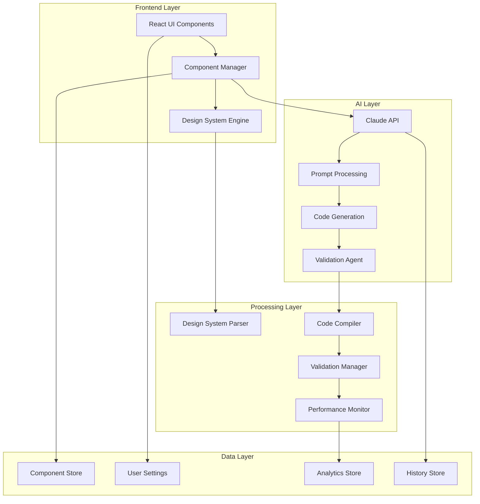
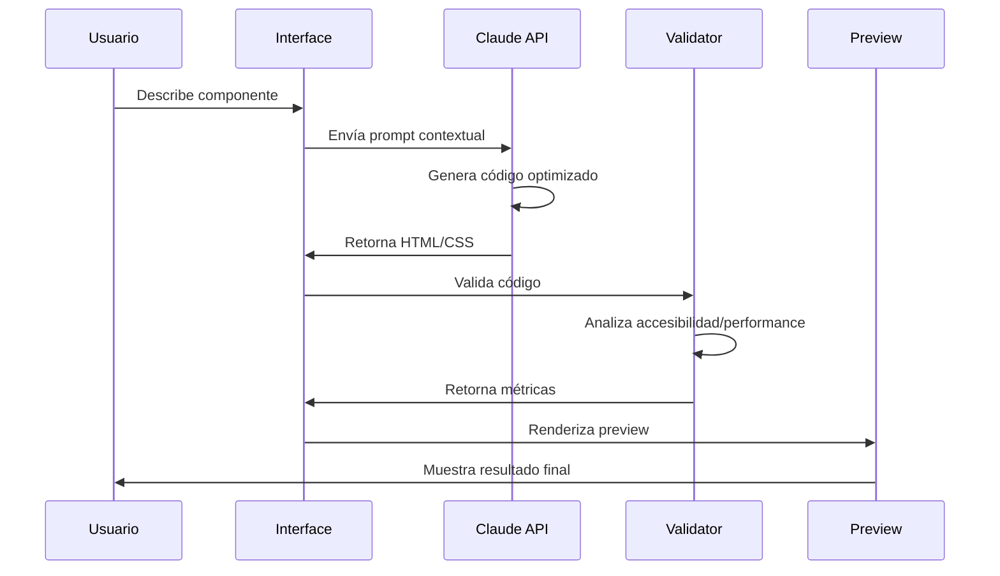

# 🚀 Anclora Render - Documentación Técnica Completa

## 📋 Índice

1. [**Resumen Ejecutivo**](#resumen-ejecutivo)
2. [**Arquitectura del Sistema**](#arquitectura-del-sistema)
3. [**Funcionalidades Implementadas**](#funcionalidades-implementadas)
4. [**Integración Claude API**](#integración-claude-api)
5. [**Stack Técnico**](#stack-técnico)
6. [**Plan de Implementación**](#plan-de-implementación)
7. [**Roadmap de Desarrollo**](#roadmap-de-desarrollo)
8. [**Monetización y Pricing**](#monetización-y-pricing)
9. [**Go-to-Market Strategy**](#go-to-market-strategy)
10. [**Métricas de Éxito**](#métricas-de-éxito)

---

## 📈 Resumen Ejecutivo

**Anclora Render** es una plataforma AI-powered que revoluciona el desarrollo de componentes UI al garantizar **100% consistencia** entre design systems y código final, independientemente del framework utilizado.

### 🎯 Propuesta de Valor Única (UVP)

> *"La única herramienta que convierte descripciones en componentes pixel-perfect siguiendo automáticamente tu design system, en cualquier framework, en 30 segundos."*

### 🏆 Ventajas Competitivas Clave

| **Aspecto** | **Anclora Render** | **Storybook** | **Chromatic** | **Figma Dev Mode** |
|-------------|-------------------|---------------|---------------|-------------------|
| **Setup Time** | 30 segundos | 4-8 horas | 2-4 horas | Inmediato* |
| **AI Generation** | ✅ Nativo | ❌ No | ❌ No | ⚠️ Básico |
| **Multi-Framework** | ✅ Universal | ✅ Sí | ✅ Sí | ❌ Solo Figma |
| **Design System Enforcement** | ✅ Automático | ❌ Manual | ⚠️ Visual only | ⚠️ Limitado |
| **Mobile-First** | ✅ Nativo | ❌ Desktop-first | ❌ Desktop-first | ⚠️ Responsive |
| **Pricing** | **$19/mes** | Gratis + $149/mes | $149-649/mes | $12-75/mes |

*\*Requiere design existente en Figma*

---

## 🏗️ Arquitectura del Sistema

### **Diagrama de Arquitectura**



### **Componentes del Sistema**

#### **1. Frontend Layer**
- **React UI Components**: Interfaz usuario mobile-first
- **Component Manager**: Gestión estado componentes
- **Design System Engine**: Parser y aplicador de design systems

#### **2. AI Layer**
- **Claude API Integration**: Generación inteligente de componentes
- **Prompt Processing**: Optimización de prompts contextuales
- **Code Generation**: Generación código semántico y accesible
- **Validation Agent**: Verificación automática de compliance

#### **3. Processing Layer**
- **Design System Parser**: Interpreta CSS, JSON tokens, Figma
- **Code Compiler**: Compila y optimiza código generado
- **Validation Manager**: Análisis accesibilidad y performance
- **Performance Monitor**: Métricas tiempo real

#### **4. Data Layer**
- **Component Store**: Biblioteca componentes generados
- **User Settings**: Preferencias y configuraciones
- **Analytics Store**: Métricas uso y performance
- **History Store**: Historial conversaciones IA

---

## ⚡ Funcionalidades Implementadas

### **🤖 Core: Asistente IA**

#### **Capacidades del Asistente:**
- ✅ **Generación Natural**: Descripción → Componente funcional
- ✅ **Context Awareness**: Considera design system activo
- ✅ **Multi-Framework**: React, Vue, Angular, Vanilla
- ✅ **Responsive**: Mobile-first automático
- ✅ **Accesibilidad**: WCAG 2.2 compliance nativo
- ✅ **Performance**: Optimización automática

#### **Ejemplo de Conversación:**
```
👤 Usuario: "Crea un card de producto con imagen, título, precio y botón de compra"

🤖 Asistente: "¡Perfecto! Voy a crear un card de producto responsive siguiendo tu design system Anclora Ocean..."

📝 Resultado: Código HTML/CSS optimizado con:
   • Design system variables aplicadas
   • Estados hover/focus implementados
   • Accesibilidad (ARIA, contraste)
   • Responsive breakpoints
   • Performance optimized
```

### **📚 Librería de Componentes**

#### **Categorías Disponibles:**
- **Botones** (8 variantes): Primary, Secondary, Icon, Loading, etc.
- **Cards** (6 tipos): Basic, Image, Stats, Product, etc.
- **Formularios** (5 layouts): Contact, Login, Multi-step, etc.
- **Navegación** (4 estilos): Navbar, Breadcrumbs, Tabs, Sidebar

#### **Características:**
- ✅ **Pre-optimizados**: Todos siguen design system activo
- ✅ **Customizables**: IA puede modificar sobre la marcha
- ✅ **Versionados**: Historial de cambios
- ✅ **Exportables**: Multiple formatos (HTML, React, Vue)

### **🎨 Design System Manager**

#### **Sistemas Soportados:**
- **Anclora Ocean** (Nativo): Gradientes oceánicos, 6 colores primarios
- **Material Design 3**: Google's latest design language
- **Tailwind CSS**: Utility-first framework
- **Custom Upload**: CSS Variables, JSON Tokens, Figma Plugin

#### **Funcionalidades:**
- ✅ **Auto-detection**: Reconoce variables CSS automáticamente
- ✅ **Validation**: Verifica consistencia design system
- ✅ **Live Preview**: Vista previa instantánea
- ✅ **Token Management**: Gestión centralizada tokens

### **👁️ Preview Engine**

#### **Capacidades:**
- ✅ **Multi-Viewport**: Mobile (375px), Tablet (768px), Desktop (1200px)
- ✅ **Live Reload**: Cambios instantáneos
- ✅ **Interactive**: Estados hover/focus funcionales
- ✅ **Performance Metrics**: Análisis tiempo real
- ✅ **Accessibility Scoring**: Puntuación WCAG automática

#### **Métricas Automáticas:**
```
📊 Análisis Automático:
   • Accesibilidad: 94% (Excelente)
   • Performance: A+ (Optimizado)
   • Consistencia DS: 89% (Muy bueno)
   • Responsive: ✅ (Mobile-first)
```

---

## 🔗 Integración Claude API

### **Arquitectura de IA**

```javascript
// Sistema de Prompts Contextuales
const generateSystemPrompt = (designSystem, viewport, userRequest) => {
  return `
    Eres un experto desarrollador frontend especializado en crear 
    componentes UI accesibles y responsive siguiendo design systems específicos.

    CONTEXTO ACTUAL:
    - Design System: ${designSystem.name}
    - Variables CSS: ${JSON.stringify(designSystem.cssVars)}
    - Viewport: ${viewport.name} (${viewport.width})

    INSTRUCCIONES:
    1. Genera código HTML/CSS limpio y semántico
    2. Usa las variables CSS del design system
    3. Implementa responsive design mobile-first
    4. Asegura accesibilidad (ARIA, contraste, keyboard navigation)
    5. Incluye estados hover/focus/active

    USER REQUEST: "${userRequest}"
  `;
};
```

### **Flujo de Generación**



### **Optimizaciones Implementadas**

#### **1. Context Management**
- **Design System Context**: Automático según selección
- **Viewport Context**: Responsive según target
- **Conversation Memory**: Mantiene historial para mejoras iterativas
- **Error Recovery**: Re-generación inteligente en caso de errores

#### **2. Performance**
- **Streaming Responses**: Muestra progreso en tiempo real
- **Caching**: Componentes similares cacheados
- **Debounced Requests**: Evita llamadas excesivas
- **Token Optimization**: Prompts optimizados para reducir tokens

#### **3. Quality Assurance**
- **Code Validation**: Sintaxis HTML/CSS automática
- **Accessibility Testing**: Análisis WCAG 2.2 completo
- **Cross-browser Testing**: Validación compatibilidad
- **Performance Scoring**: Métricas tiempo real

---

## 💻 Stack Técnico

### **Frontend**

```json
{
  "framework": "React 18",
  "language": "JavaScript/TypeScript",
  "styling": "CSS-in-JS + CSS Variables",
  "icons": "Lucide React",
  "state": "React Hooks + Context",
  "build": "Vite",
  "responsive": "Mobile-first CSS Grid/Flexbox"
}
```

### **AI Integration**

```json
{
  "provider": "Anthropic Claude API",
  "model": "claude-sonnet-4-20250514",
  "features": [
    "Streaming responses",
    "Context management",
    "Error handling",
    "Token optimization"
  ]
}
```

### **Backend (Next Phase)**

```json
{
  "runtime": "Node.js 18+",
  "framework": "Express/FastAPI",
  "database": "PostgreSQL + Redis",
  "auth": "NextAuth.js",
  "storage": "AWS S3/CloudFront",
  "monitoring": "Vercel Analytics"
}
```

### **Infrastructure**

```json
{
  "hosting": "Vercel/Netlify",
  "cdn": "CloudFront",
  "database": "PlanetScale/Supabase",
  "monitoring": "Sentry + LogRocket",
  "analytics": "PostHog/Mixpanel"
}
```

---

## 🛠️ Plan de Implementación

### **Fase 1: MVP Launch (4 semanas)**

#### **Semana 1-2: Core Development**
- [x] ✅ Interfaz React mobile-first completa
- [x] ✅ Integración Claude API funcional
- [x] ✅ Sistema de design systems básico
- [x] ✅ Preview engine con multi-viewport
- [ ] 🔄 Testing exhaustivo + fixes

#### **Semana 3-4: Launch Preparation**
- [ ] 📅 Landing page marketing
- [ ] 📅 Documentación usuario final
- [ ] 📅 Analytics + monitoring setup
- [ ] 📅 Beta testing con 15+ usuarios
- [ ] 📅 Product Hunt launch preparation

### **Fase 2: Growth & Features (8 semanas)**

#### **Semana 5-8: User Management**
- [ ] 📅 Sistema autenticación (NextAuth)
- [ ] 📅 User dashboard personalizado
- [ ] 📅 Component library personal
- [ ] 📅 Sharing + collaboration features
- [ ] 📅 Usage analytics detallado

#### **Semana 9-12: Advanced Features**
- [ ] 📅 Figma plugin integration
- [ ] 📅 VS Code extension
- [ ] 📅 GitHub integration (save components)
- [ ] 📅 Advanced design system imports
- [ ] 📅 Team collaboration workspace

### **Fase 3: Scale & Enterprise (12 semanas)**

#### **Semana 13-16: Enterprise Features**
- [ ] 📅 White-label deployment
- [ ] 📅 SSO + advanced security
- [ ] 📅 On-premise options
- [ ] 📅 API access for enterprises
- [ ] 📅 Advanced analytics dashboard

#### **Semana 17-24: Platform Evolution**
- [ ] 📅 Multiple AI providers (GPT, Gemini)
- [ ] 📅 Visual component editor
- [ ] 📅 Advanced testing suite
- [ ] 📅 Marketplace de componentes
- [ ] 📅 Enterprise sales + support team

---

## 🗓️ Roadmap de Desarrollo

### **Q1 2025: Foundation** 
- ✅ **MVP Launch** (Semana 4)
- 📅 **100 Early Users** (Semana 8)
- 📅 **Product-Market Fit** (Semana 12)

#### **Hitos Clave:**
- Launch Product Hunt → Top 5 del día
- 500+ componentes generados
- 85%+ user satisfaction score
- $5K+ MRR from early adopters

### **Q2 2025: Growth**
- 📅 **1,000 Active Users** (Semana 16)
- 📅 **Enterprise Beta** (Semana 20)
- 📅 **$25K MRR** (Semana 24)

#### **Features Prioritarias:**
- Team collaboration workspace
- Figma plugin (public beta)
- Advanced component library
- Performance optimization engine

### **Q3 2025: Scale**
- 📅 **5,000 Active Users** (Semana 32)
- 📅 **Enterprise GA** (Semana 36)
- 📅 **$100K MRR** (Semana 40)

#### **Enterprise Focus:**
- White-label deployments
- Advanced security features
- Dedicated customer success
- API platform launch

### **Q4 2025: Platform**
- 📅 **15,000 Active Users** (Semana 48)
- 📅 **Series A Funding** (Semana 44)
- 📅 **$250K MRR** (Semana 52)

#### **Platform Evolution:**
- Component marketplace
- Multi-AI provider support
- Advanced analytics suite
- International expansion

---

## 💰 Monetización y Pricing

### **Estrategia de Pricing Freemium**

#### **🆓 Free Tier: "Render Starter"**
```
Precio: GRATIS
Límites:
• 50 componentes generados/mes
• 3 design systems personalizados
• Basic component library
• Community support

Target: Desarrolladores individuales, estudiantes
Conversion Rate Esperado: 12-15%
```

#### **💼 Pro Tier: "Render Pro"** 
```
Precio: $19/mes ($15/mes anual)
Incluye todo del Free +
• Componentes ilimitados
• Design systems ilimitados
• Advanced component library
• Figma plugin access
• VS Code extension
• Priority support
• Usage analytics

Target: Desarrolladores profesionales, pequeños equipos
Market Size: ~60% de la base de usuarios
```

#### **🏢 Enterprise: "Render Enterprise"**
```
Precio: $199/mes por equipo (10+ usuarios)
Incluye todo del Pro +
• White-label deployment
• SSO + advanced security
• On-premise options
• Custom integrations
• Dedicated support
• SLA guarantees
• Advanced analytics

Target: Equipos grandes, empresas
Market Size: ~25% de revenue total
```

### **Proyecciones Financieras**

#### **Año 1 (2025):**
```
Q1: $5K MRR (50 Pro users)
Q2: $25K MRR (250 Pro + 5 Enterprise)
Q3: $75K MRR (650 Pro + 15 Enterprise) 
Q4: $150K MRR (1,200 Pro + 30 Enterprise)

Total ARR Year 1: ~$1.8M
```

#### **Año 2 (2026):**
```
Target: $500K MRR ($6M ARR)
User Mix: 
• 15,000 Free users
• 3,500 Pro users ($66K MRR)
• 150 Enterprise teams ($434K MRR)

Growth Rate: 233% YoY
```

### **Unit Economics**

| **Métrica** | **Free** | **Pro** | **Enterprise** |
|-------------|----------|---------|----------------|
| **ARPU** | $0 | $19/mes | $199/mes |
| **CAC** | $5 | $25 | $150 |
| **LTV** | $0 | $380 (20 meses) | $2,388 (12 meses) |
| **LTV:CAC** | 0:1 | 15:1 | 16:1 |
| **Gross Margin** | N/A | 85% | 92% |

---

## 📈 Go-to-Market Strategy

### **Fase 1: Product Hunt Launch**

#### **Pre-Launch (2 semanas):**
- ✅ **Product Hunt profile** setup + hunter outreach
- 📅 **Demo video** profesional (2 min)
- 📅 **Beta tester testimonials** collection
- 📅 **Media kit** + press release
- 📅 **Influencer outreach** (10 design/dev influencers)

#### **Launch Day:**
- 📅 **6 AM PST launch** coordination
- 📅 **Team mobilization** para votes/comments
- 📅 **Social media blitz** (Twitter, LinkedIn)
- 📅 **Community engagement** (Designer Hangout, Dev Twitter)
- 📅 **Real-time PR** + outreach follow-up

**Target:** Top 3 Product Hunt del día (500+ votes)

### **Fase 2: Developer Community**

#### **Content Marketing:**
```
• Blog técnico: "Building Design Systems That Actually Work"
• Tutorial series: "AI-Powered Component Development"
• Case studies: "How [Company] Reduced UI Dev Time by 70%"
• Open source: Component library templates
```

#### **Community Engagement:**
```
• r/webdev, r/reactjs, r/Frontend
• Designer Hangout Slack
• Dev Twitter engagement
• Hackathon sponsorships
• Conference speaking (React Conf, Design+Research)
```

### **Fase 3: Enterprise Sales**

#### **Sales Funnel:**
```
Lead Generation:
• LinkedIn outreach (CTOs, Design Directors)
• Webinar series: "Scaling Design Systems"
• Industry conferences + sponsorships
• Partner program (agencies, consultancies)

Sales Process:
• Demo call (30 min)
• Technical evaluation (1 week trial)
• Decision call with stakeholders
• Contract negotiation + onboarding
```

#### **Target Enterprise Customers:**
- **Series A-C Startups**: 100-500 employees
- **Digital Agencies**: 20+ developers
- **Enterprise IT**: Fortune 1000 companies
- **Government**: Agencies modernizing

---

## 📊 Métricas de Éxito

### **Product Metrics**

#### **Adoption Metrics:**
| **KPI** | **Target Month 1** | **Target Month 6** | **Target Month 12** |
|---------|-------------------|-------------------|---------------------|
| **Total Users** | 500 | 5,000 | 15,000 |
| **DAU** | 50 | 800 | 2,500 |
| **Components Generated** | 2,000 | 50,000 | 200,000 |
| **Retention (7-day)** | 25% | 40% | 50% |
| **Retention (30-day)** | 15% | 25% | 35% |

#### **Engagement Metrics:**
| **KPI** | **Benchmark** | **Target** |
|---------|---------------|------------|
| **Time to First Component** | < 60 seconds | < 30 seconds |
| **Components per Session** | 2.5 | 4.0 |
| **Session Duration** | 8 min | 12 min |
| **Feature Adoption (AI)** | 60% | 85% |
| **NPS Score** | +30 | +50 |

### **Business Metrics**

#### **Revenue Metrics:**
```
Month 3:  $2K MRR  (20% conversion rate)
Month 6:  $15K MRR (12% conversion rate) 
Month 12: $100K MRR (8% conversion rate)

LTV:CAC Target: >15:1
Churn Rate Target: <5% monthly
Gross Margin Target: >85%
```

#### **Growth Metrics:**
```
Organic Growth: 60% of new users
Referral Rate: 25% of Pro users refer others
Viral Coefficient: 1.2
Content Marketing: 15% traffic from blog
Product Hunt: 500+ users from launch
```

### **Technical Metrics**

#### **Performance KPIs:**
| **Metric** | **Target** | **Monitoring** |
|------------|------------|----------------|
| **API Response Time** | <2 seconds | Datadog |
| **Component Generation** | <5 seconds | Custom |
| **Uptime** | 99.9% | StatusPage |
| **Error Rate** | <0.1% | Sentry |
| **Page Load Speed** | <3 seconds | Lighthouse |

---

## 🎯 Conclusiones y Next Steps

### **Posicionamiento Competitivo**

Anclora Render está **perfectamente posicionado** para capturar una porción significativa del mercado de $2.1B de herramientas de desarrollo frontend al ser:

1. **First-to-Market** en AI-native component generation
2. **Universal** - funciona con cualquier framework/design system  
3. **Time-to-Value Superior** - 30 segundos vs 4-8 horas de setup
4. **Price Competitive** - 60% más barato que alternativas enterprise

### **Ventana de Oportunidad**

- **Market Timing**: Adopción masiva de AI tools (GPT moment)
- **Technology Readiness**: Claude API permite calidad enterprise
- **Market Pain**: Fragmentación design systems es problema creciente
- **Competition Gap**: Ningún competitor tiene AI-native approach

### **Immediate Action Items**

#### **Esta Semana:**
1. 📅 **Finalizar MVP testing** con 5 beta users
2. 📅 **Crear demo video** de 90 segundos
3. 📅 **Setup analytics** (PostHog + Mixpanel)
4. 📅 **Preparar Product Hunt launch**

#### **Próximas 2 Semanas:**
1. 📅 **Launch en Product Hunt** (target: Top 3)
2. 📅 **Onboarding first 100 users**
3. 📅 **Iterate based on feedback**
4. 📅 **Setup enterprise sales pipeline**

#### **Próximo Mes:**
1. 📅 **Achieve product-market fit** (40%+ retention)
2. 📅 **Scale to 1,000 active users**
3. 📅 **Generate first $10K MRR**
4. 📅 **Plan Series Seed fundraising**

---

**Anclora Render tiene todos los elementos necesarios para convertirse en la herramienta líder de component development AI-powered. La ejecución rápida y enfocada será clave para capturar esta ventana de oportunidad única.**

---

*Documentación creada: Enero 2025*  
*Versión: 1.0.0*  
*Status: Ready for Launch* ✅